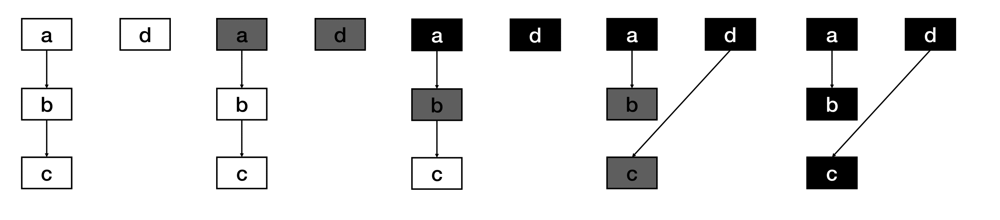

## 内存回收的算法

- 引用计数（Python，PHP，Swift）
  - 对每一个对象维护一个引用计数，当引用该对象的对象被销毁的时候，引用计数减 1，当引用计数为 0 的时候，回
    收该对象
  - 优点：对象可以很快的被回收，不会出现内存耗尽或达到某个阀值时才回收
  - 缺点：不能很好的处理循环引用，而且实时维护引用计数，有也一定的代价

- 标记-清除（Golang）

  - 从根变量开始遍历所有引用的对象，引用的对象标记为"被引用"，没有被标记的进行回收

  - 优点：解决引用计数的缺点

  - 缺点：需要 STW（stop the word），即要暂停程序运行

- 分代收集（Java）
  - 按照生命周期进行划分不同的代空间，生命周期长的放入老年代，短的放入新生代，新生代的回收频率高于老年代的频率

## GC的工作流程

Golang GC 的大部分处理是和用户代码并行的。

- Mark：

  - Mark Prepare: 初始化 GC 任务，包括开启写屏障 (write barrier) 和辅助 GC(mutator assist)，统计root对象的任
    务数量等。这个过程需要STW。

  - GC Drains: 扫描所有 root 对象，包括全局指针和 goroutine(G) 栈上的指针（扫描对应 G 栈时需停止该 G)，将其
    加入标记队列(灰色队列)，并循环处理灰色队列的对象，直到灰色队列为空。该过程后台并行执行

- Mark Termination：完成标记工作，重新扫描(re-scan)全局指针和栈。因为 Mark 和用户程序是并行的，所以在 Mark 过
  程中可能会有新的对象分配和指针赋值，这个时候就需要通过写屏障（write barrier）记录下来，re-scan 再检查一下，这
  个过程也是会 STW 的。

- Sweep：按照标记结果回收所有的白色对象，该过程后台并行执行

- Sweep Termination：对未清扫的 span 进行清扫, 只有上一轮的 GC 的清扫工作完成才可以开始新一轮的 GC。

## 三色标记过程

- GC 开始时，认为所有 object 都是 白色，即垃圾。
- 从 root 区开始遍历，被触达的 object 置成 灰色。

- 遍历所有灰色 object，将他们内部的引用变量置成 灰色，自身置成 黑色

- 循环第 3 步，直到没有灰色 object 了，只剩下了黑白两种，白色的都是垃圾。
- 对于黑色 object，如果在标记期间发生了写操作，写屏障会在真正赋值前将新对象标记为 灰色。
- 标记过程中，mallocgc 新分配的 object，会先被标记成 黑色 再返回。

## 垃圾回收触发机制

- 内存分配量达到阀值触发 GC

  - 每次内存分配时都会检查当前内存分配量是否已达到阀值，如果达到阀值则立即启动 GC。

    - 阈值 = 上次 GC 内存分配量 * 内存增长率

    - 内存增长率由环境变量 GOGC 控制，默认为 100，即每当内存扩大一倍时启动 GC。

- 定期触发 GC
  -  默认情况下，最长 2 分钟触发一次 GC，这个间隔在 src/runtime/proc.go:forcegcperiod 变量中被声明

- 手动触发
  - 程序代码中也可以使用 runtime.GC()来手动触发 GC。这主要用于 GC 性能测试和统计。
