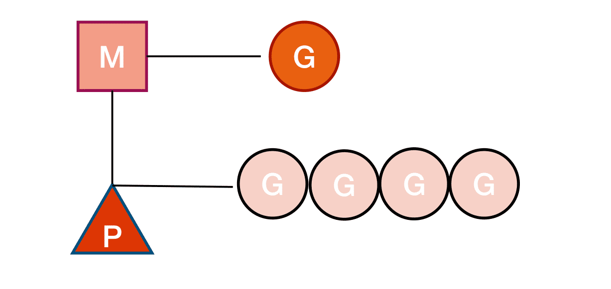
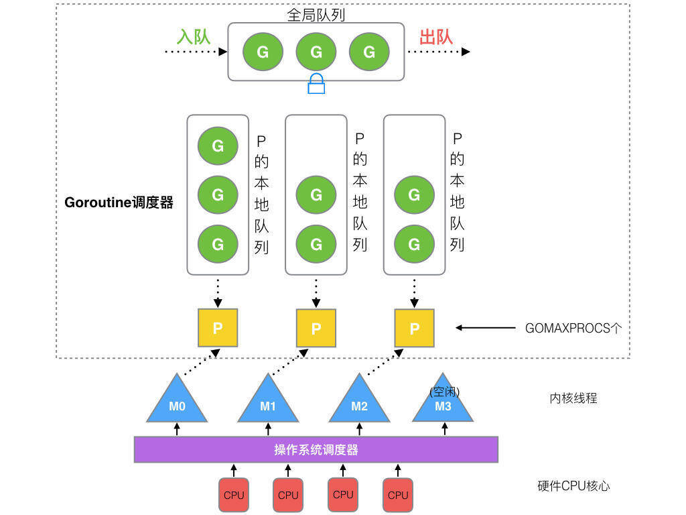

## GMP的关系

Go 语言基于 GMP 模型实现用户态线程。

- G: 代表 Goroutine，存储了 Goroutine 的执行栈信息、Goroutine 状态以及 Goroutine 的任务函数等，而且 G 对象是可以重用的；
- P: 代表调度器，负责调度 goroutine，维护一个本地 goroutine 队列，M 从 P 上获得 goroutine 并执行，同时还负责部分内存的管理。
- M: 代表着真正的执行计算资源。在绑定有效的 P 后，进入一个调度循环，而调度循环的机制大致是从 P 的本地运行队列以及全局队列中获取 G，切换到 G 的执行栈上并执行 G 的函数，调用 goexit 做清理工作并回到 M，如此反复。M 并不保留 G 状态，这是 G 可以跨M 调度的基础。

在 Go 中，线程是运行 goroutine 的实体，调度器的功能是把可运行的 goroutine 分配到工作线程上。Goroutine 调度器和 OS 调度器是通过 M 结合起来的，每个 M 都代表了 1 个内核线程，OS 调度器负责把内核线程分配到 CPU 的核上执行。

## 调度简单过程

Goroutine 们要竞争的“CPU”资源就是操作系统线程。这样，Goroutine 调度器的任务也就明确了：将 Goroutine 按照一定算法放到不同的操作系统线程中去执行。

- 全局队列（Global Queue）：存放等待运行的 G。
- P 的本地队列：同全局队列类似，存放的也是等待运行的 G，存的数量有限，不超过 256 个。新建 G’时，G’优先加入到 P 的本地队列，如果队列满了，则会把本地队列中一半的 G 移动到全局队列。
- P 列表：所有的 P 都在程序启动时创建，并保存在数组中，最多有 GOMAXPROCS(可配置) 个。
  M：线程想运行任务就得获取 P，从 P 的本地队列获取 G，P 队列为空时，M 也会尝试从全局队列拿一批 G 放到 P 的本地队列，或从其他 P 的本地队列偷一半放到自己 P 的本地队列。M 运行 G，G 执行之后，M 会从 P 获取下一个 G，不断重复下去。

## 调度器的行为

- 为了保证公平，当全局运行队列中有待执行的 Goroutine 时，通过 schedtick 保证有一定几率会从全局的运行队列中查找对应的 Goroutine•
- 从处理器本地的运行队列中查找待执行的 Goroutine
- 如果前两种方法都没有找到 Goroutine，会通过 runtime.findrunnable 进行阻塞地查找Goroutine

  - 从本地运行队列、全局运行队列中查找
  - 从网络轮询器中查找是否有 Goroutine 等待运行
  - 通过 runtime.runqsteal 尝试从其他随机的处理器中窃取待运行的 Goroutine
