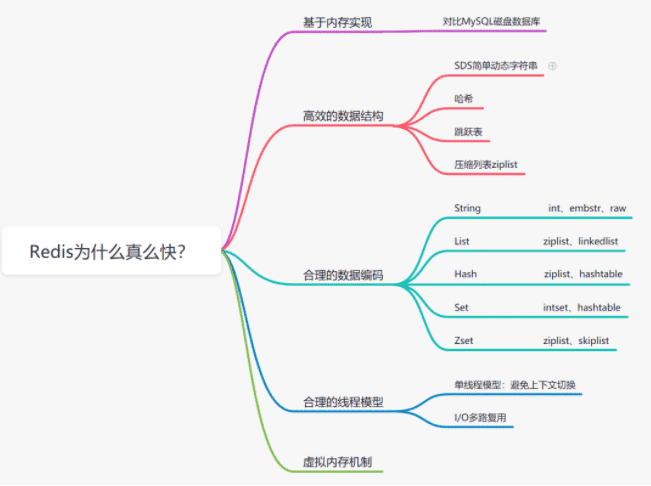
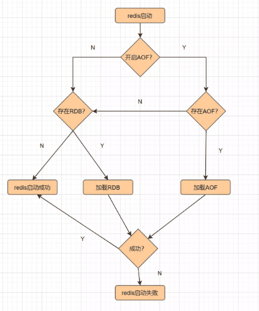
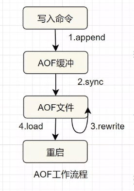
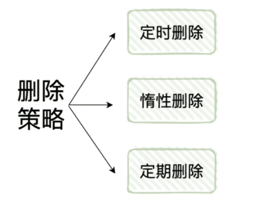
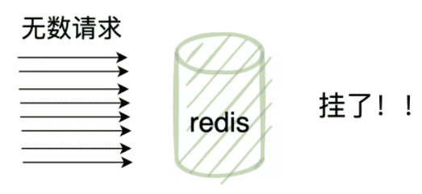
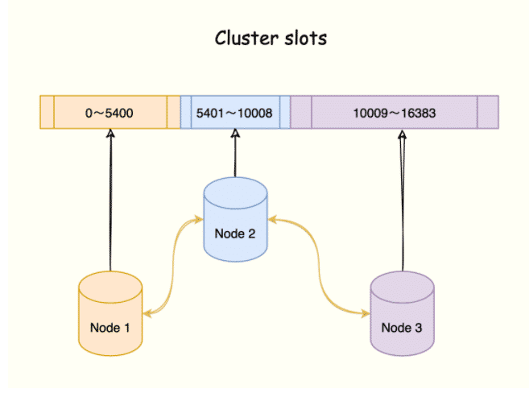
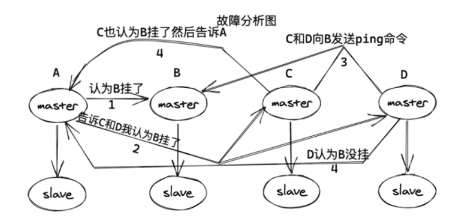
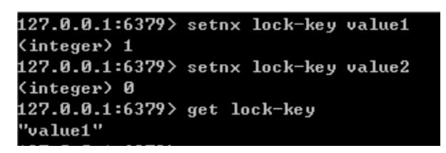
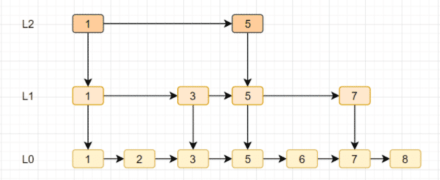

redis: redis 即 Remote Dictionary Server，用中文翻译过来可以理解为远程数据服务或远程字典服务。其是使用 C 语言的编写的 key-value 存储系统。

## 1.1 redis 适合的场景

- 缓存：减轻 MySQL 的查询压力，提升系统性能；
- 排行榜：利用 Redis 的 SortSet（有序集合）实现；
- 计算器 / 限速器：利用 Redis 中原子性的自增操作，我们可以统计类似用户点赞数、用户访问数等。这类操作如果用 MySQL，频繁的读写会带来相当大的压力；限速器比较典型的使用场景是限制某个用户访问某个 API 的频率，常用的有抢购时，防止用户疯狂点击带来不必要的压力；
- 好友关系：利用集合的一些命令，比如求交集、并集、差集等。可以方便解决一些共同好友、共同爱好之类的功能；
- 消息队列：除了 Redis 自身的发布 / 订阅模式，我们也可以利用 List 来实现一个队列机制，比如：到货通知、邮件发送之类的需求，不需要高可靠，但是会带来非常大的 DB 压力，完全可以用 List 来完成异步解耦；
- Session 共享：Session 是保存在服务器的文件中，如果是集群服务，同一个用户过来可能落在不同机器上，这就会导致用户频繁登陆；采用 Redis 保存 Session 后，无论用户落在那台机器上都能够获取到对应的 Session 信息。

## 1.2 redis 不适合的场景

数据量太大、数据访问频率非常低的业务都不适合使用 Redis，数据太大会增加成本，访问频率太低，保存在内存中纯属浪费资源。

## 1.3 redis 为什么这么快？

redis 总共有八种数据结构，五种基本数据类型和三种特殊数据类型。

- 五种基本数据类型
  - string : 字符串类型，常被用来存储计数器，粉丝数等，简单的分布式锁也会用到该类型。
  - hashmap :key - value 形式的，value 是一个 map。
  - list : 基本的数据类型，列表。在 Redis 中可以把 list 用作栈、队列、阻塞队列。
  - set : 集合，不能有重复元素，可以做点赞，收藏等。
  - zset : 有序集合，不能有重复元素，有序集合中的每个元素都需要指定一个分数，根据分数对元素进行升序排序。可以做排行榜。
- 三种特殊数据类型
  - geospatial :Redis 在 3.2 推出 Geo 类型，该功能可以推算出地理位置信息，两地之间的距离。
  - hyperloglog : 基数：数学上集合的元素个数，是不能重复的。这个数据结构常用于统计网站的 UV。
  - bitmap :bitmap 就是通过最小的单位 bit 来进行 0 或者 1 的设置，表示某个元素对应的值或者状态。一个 bit 的值，或者是 0，或者是 1；也就是说一个 bit 能存储的最多信息是 2。bitmap 常用于统计用户信息比如活跃粉丝和不活跃粉丝、登录和未登录、是否打卡等。
- Redis 在 4.0 的时候引入了多线程来做大缓存的清除处理工作，主要是体现在大数据的异步删除功能上，例如 unlink key、flushdb async、flushall async 等，先清除 key ，接着异步清除对应的 value。
- 在 Redis 6.0 之前的网络模型都是标准的单线程 reactor 模型。在 6.0 开始引入了一个非标准的多线程 reactor 模型，sub-reactor 此时会使用 socket 读取 client 请求，并处理命令的解析，然后具体写还是在主线程上执行。

## 3.1 redis 使用了多线程不会有线程安全的问题吗？为什么 redis 6.0 之后改多线程呢？

不会，其实 redis 还是使用单线程模型来处理客户端的请求，只是使用多线程来处理数据的读写和协议解析，执行命令还是使用单线程，所以是不会有线程安全的问题。

之所以加入了多线程因为 redis 的性能瓶颈在于网络 IO 而非 CPU，使用多线程能提升 IO 读写的效率，从而整体提高 redis 的性能。

redis 有两种持久化的方式，AOF 和 RDB。

## AOF:

AOF（append only file） 持久化，redis 每次执行一个命令时，都会把这个「命令原本的语句记录到一个. aod 的文件当中，然后通过 fsync 策略，将命令执行后的数据持久化到磁盘中」(不包括读命令)。

### AOF 的优点:

1. AOF 可以「更好的保护数据不丢失」，一般 AOF 会以每隔 1 秒，通过后台的一个线程去执行一次 fsync 操作，如果 redis 进程挂掉，最多丢失 1 秒的数据。
2. AOF 是将命令直接追加在文件末尾的,「写入性能非常高」。
3. AOF 日志文件的命令通过非常可读的方式进行记录，这个非常「适合做灾难性的误删除紧急恢复」，如果某人不小心用 flushall 命令清空了所有数据，只要这个时候还没有执行 rewrite，那么就可以将日志文件中的 flushall 删除，进行恢复。

### AOF 的缺点:

1. 对于同一份数据源来说, 一般情况下 AOF 文件比 RDB 数据快照要大。
2. 由于 .aof 的每次命令都会写入，那么相对于 RDB 来说「需要消耗的性能也就更多」，当然也会有 aof 重写将 aof 文件优化。
3. 「数据恢复比较慢」，不适合做冷备。

## RDB:

把某个时间点 redis 内存中的数据以二进制的形式存储的一个. rdb 为后缀的文件当中，也就是「周期性的备份 redis 中的整个数据」，这是 redis 默认的持久化方式，也就是我们说的快照 (snapshot)，是采用 fork 子进程的方式来写时同步的。

### RDB 的优点:

1. 它是将某一时间点 redis 内的所有数据保存下来，所以当我们做「大型的数据恢复时，RDB 的恢复速度会很快」。
2. 由于 RDB 的 FROK 子进程这种机制，队友给客户端提供读写服务的影响会非常小。

### RDB 的缺点:

举个例子假设我们定时 5 分钟备份一次，在 10:00 的时候 redis 备份了数据，但是如果在 10:04 的时候服务挂了，那么我们就会丢失在 10:00 到 10:04 的整个数据。

1. 「有可能会产生长时间的数据丢失」。
2. 可能会有长时间停顿: 我们前面讲了，fork 子进程这个过程是和 redis 的数据量有很大关系的，如果「数据量很大，那么很有可能会使 redis 暂停几秒」。

- 定时过期：每个设置过期时间的 key 都需要创建一个定时器，到过期时间就会立即清除。该策略可以立即清除过期的数据，对内存很友好；但是会占用大量的 CPU 资源去处理过期的数据，从而影响缓存的响应时间和吞吐量。
- 惰性过期：只有当访问一个 key 时，才会判断该 key 是否已过期，过期则清除。该策略可以最大化地节省 CPU 资源，却对内存非常不友好。极端情况可能出现大量的过期 key 没有再次被访问，从而不会被清除，占用大量内存。
- 定期过期：每隔一定的时间，会扫描一定数量的数据库的 expires 字典中一定数量的 key，并清除其中已过期的 key。该策略是前两者的一个折中方案。通过调整定时扫描的时间间隔和每次扫描的限定耗时，可以在不同情况下使得 CPU 和内存资源达到最优的平衡效果。

实际上 redis 定义了「8 种内存淘汰策略」用来处理 redis 内存满的情况：

1. noeviction：默认策略，直接返回错误，不淘汰任何已经存在的 redis 键；
2. allkeys-lru：所有的键使用 LRU（最近最少使用）算法进行淘汰；
3. volatile-lru：从设置了过期时间的 key 中使用 LRU（最近最少使用）算法进行淘汰；
4. allkeys-random：随机删除 redis 键；
5. volatile-random：随机删除有过期时间的 redis 键；
6. volatile-ttl：删除快过期的 redis 键；
7. volatile-lfu：根据 LFU 算法从有过期时间的键删除；
8. allkeys-lfu：根据 LFU 算法从所有键删除；

热 key 就是说，在某一时刻，有非常多的请求访问某个 key，流量过大，导致该 redis 服务器宕机。

## 解决方案:

- redis 集群扩容：增加分片副本，均衡读流量；
- 可以将结果缓存到本地内存中；
- 将热 key 分散到不同的服务器中；

## 缓存穿透

缓存穿透是指用户请求的数据在缓存中不存在并且在数据库中也不存在，导致用户每次请求该数据都要去数据库中查询一遍，然后返回空。

### 解决办法:

1. 布隆过滤器

将所有可能存在的数据哈希到一个足够大的 bitmap 中，一个一定不存在的数据会被这个 bitmap 拦截掉，从而避免了对底层存储系统的查询压力。

1. 返回空对象

如果一个查询返回的数据为空，我们仍然把这个空结果进行缓存，但它的过期时间会很短，最长不超过五分钟。

缓存空对象带来的问题：

- 空值做了缓存，那么缓存中便存了更多的键，需要更多的内存空间，比较有效的方法是针对这类数据设置一个较短的过期时间，让其自动剔除。
- 缓存和存储的数据会有一段时间窗口的不一致，可能会对业务有一定影响。可以利用消息系统或者其他方式清除掉缓存层中的空对象。

## 缓存击穿

缓存击穿，是指一个 key 非常热点，在不停的扛着大并发，当这个 key 在失效的瞬间，持续的大并发就穿破缓存，直接请求数据库导致宕机。

### 解决办法:

1. 互斥锁

缓存失效时，不是立即去加载 db 数据，而是先使用某些带成功返回的原子操作命令，如 (Redis 的 setnx）去操作，成功的时候，再去加载 db 数据库数据和设置缓存。否则就去重试获取缓存。

1. “永远不过期”
2. 从 redis 上看，确实没有设置过期时间，这就保证了，不会出现热点 key 过期问题，也就是 “物理” 不过期。
3. 从功能上看，如果不过期，那不就成静态的了吗？所以我们把过期时间存在 key 对应的 value 里，如果发现要过期了，通过一个后台的异步线程进行缓存的构建，也就是 “逻辑” 过期。

## 缓存雪崩

缓存雪崩是指缓存中不同的数据大批量到过期时间，而查询数据量巨大，请求直接落到数据库上导致宕机。

### 解决办法:

1. 均匀过期

在缓存的时候给过期时间加上一个随机值，这样就会大幅度的减少缓存在同一时间过期。

1. 双层缓存策略、二级缓存

Cache1 为原始缓存，Cache2 为拷贝缓存，Cache1 失效时，可以访问 Cache2，Cache1 缓存失效时间设置为短期，Cache2 设置为长期。

1. 加互斥锁

在缓存失效后，通过加锁或者队列来控制读数据库写缓存的线程数量。比如对某个 key 只允许一个线程查询数据和写缓存，其他线程等待；

1. 单机模式：这也是最基本的部署方式，只需要一台机器，负责读写，一般只用于开发人员自己测试。
2. 哨兵模式：哨兵模式是一种特殊的模式，首先 redis 提供了哨兵的命令，哨兵是一个独立的进程，作为进程，它会独立运行。其原理是哨兵通过发送命令，等待 redis 服务器响应，从而监控运行的多个 redis 实例。它具备自动故障转移、集群监控、消息通知等功能。
3. cluster 集群模式：在 redis3.0 版本中支持了 cluster 集群部署的方式，这种集群部署的方式能自动将数据进行分片，每个 master 上放一部分数据，提供了内置的高可用服务，即使某个 master 挂了，服务还可以正常地提供。
4. 主从复制：在主从复制这种集群部署模式中，我们会将数据库分为两类，第一种称为主数据库 (master)，另一种称为从数据库 (slave)。主数据库会负责我们整个系统中的读写操作，从数据库会负责我们整个数据库中的读操作。其中在职场开发中的真实情况是，我们会让主数据库只负责写操作，让从数据库只负责读操作，就是为了读写分离，减轻服务器的压力。
5. 监控整个主数据库和从数据库，观察它们是否正常运行；
6. 当主数据库发生异常时，自动的将从数据库升级为主数据库，继续保证整个服务的稳定；
7. 第一个发现该 master 挂了的哨兵，向每个哨兵发送命令，让对方选举自己成为领头哨兵；
8. 其他哨兵如果没有选举过他人，就会将这一票投给第一个发现该 master 挂了的哨兵；
9. 第一个发现该 master 挂了的哨兵如果发现由超过一半哨兵投给自己，并且其数量也超过了设定的 quoram 参数，那么该哨兵就成了领头哨兵；
10. 如果多个哨兵同时参与这个选举，那么就会重复该过程，直到选出一个领头哨兵；

选出领头哨兵后，就开始了故障修复，会选出一个从数据库作为新的 master。

edis 集群是一种分布式数据库方案，集群通过分片（sharding）来进行数据管理（「分治思想」的一种实践），并提供复制和故障转移功能。

将数据划分为 16384 的 slots，每个节点负责一部分槽位。槽位的信息存储于每个节点中。

它是去中心化的，如图所示，该集群由三个 Redis 节点组成，每个节点负责整个集群的一部分数据，每个节点负责的数据多少可能不一样。

判断故障的逻辑其实与哨兵模式有点类似，在集群中，每个节点都会定期的向其他节点发送 ping 命令，通过有没有收到回复来判断其他节点是否已经下线。

如果长时间没有回复，那么发起 ping 命令的节点就会认为目标节点疑似下线，也可以和哨兵一样称作主观下线，当然也需要集群中一定数量的节点都认为该节点下线才可以，我们来说说具体过程：

1. 当 A 节点发现目标节点疑似下线，就会向集群中的其他节点散播消息，其他节点就会向目标节点发送命令，判断目标节点是否下线
2. 如果集群中半数以上的节点都认为目标节点下线，就会对目标节点标记为下线，从而告诉其他节点，让目标节点在整个集群中都下线
3. 当一个从数据库启动时，它会向主数据库发送一个 SYNC 命令，master 收到后，在后台保存快照，也就是我们说的 RDB 持久化，当然保存快照是需要消耗时间的，并且 redis 是单线程的，在保存快照期间 redis 受到的命令会缓存起来
4. 快照完成后会将缓存的命令以及快照一起打包发给 slave 节点，从而保证主从数据库的一致性。
5. 从数据库接受到快照以及缓存的命令后会将这部分数据写入到硬盘上的临时文件当中，写入完成后会用这份文件去替换掉 RDB 快照文件，当然，这个操作是不会阻塞的，可以继续接收命令执行，具体原因其实就是 fork 了一个子进程，用子进程去完成了这些功能。

因为不会阻塞，所以，这部分初始化完成后，当主数据库执行了改变数据的命令后，会异步的给 slave，这也就是我们说的复制同步阶段，这个阶段会贯穿在整个中从同步的过程中，直到主从同步结束后，复制同步才会终止。

我们刚刚说了主从之间是通过 RDB 快照来交互的，虽然看来逻辑很简单，但是还是会存在一些问题，但是会存在着一些问题。

1. master 禁用了 RDB 快照时，发生了主从同步 (复制初始化) 操作，也会生成 RDB 快照，但是之后如果 master 发成了重启，就会用 RDB 快照去恢复数据，这份数据可能已经很久了，中间就会丢失数据。
2. 在这种一主多从的结构中，master 每次和 slave 同步数据都要进行一次快照，从而在硬盘中生成 RDB 文件，会影响性能。

为了解决这种问题，redis 在后续的更新中也加入了无硬盘复制功能，也就是说直接通过网络发送给 slave，避免了和硬盘交互，但是也是有 io 消耗。

redis 为单进程单线程模式，采用队列模式将并发访问变成串行访问，且多客户端对 redis 的连接并不存在竞争关系 redis 中可以使用 SETNX 命令实现分布式锁。

当且仅当 key 不存在，将 key 的值设为 value。若给定的 key 已经存在，则 SETNX 不做任何动作 SETNX 是『SET if Not eXists』(如果不存在，则 SET) 的简写。

返回值：设置成功，返回 1 。设置失败，返回 0 。

使用 SETNX 完成同步锁的流程及事项如下：

1. 使用 SETNX 命令获取锁，若返回 0（key 已存在，锁已存在）则获取失败，反之获取成功；
2. 为了防止获取锁后程序出现异常，导致其他线程 / 进程调用 SETNX 命令总是返回 0 而进入死锁状态，需要为该 key 设置一个 “合理” 的过期时间；
3. 释放锁，使用 DEL 命令将锁数据删除；

- 跳跃表是有序集合 zset 的底层实现之一。
- 跳跃表支持平均 O（logN），最坏 O（N）复杂度的节点查找，还可以通过顺序性操作批量处理节点。
- 跳跃表实现由 zskiplist 和 zskiplistNode 两个结构组成，其中 zskiplist 用于保存跳跃表信息（如表头节点、表尾节点、长度），而 zskiplistNode 则用于表示跳跃表节点。
- 跳跃表就是在链表的基础上，增加多级索引提升查找效率。
